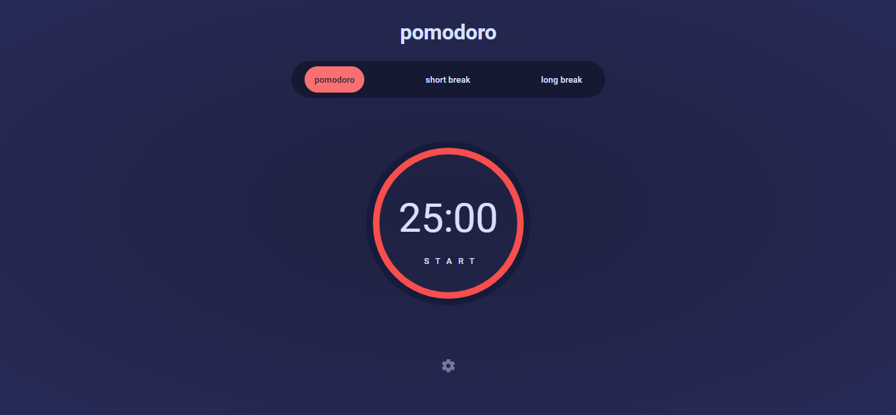
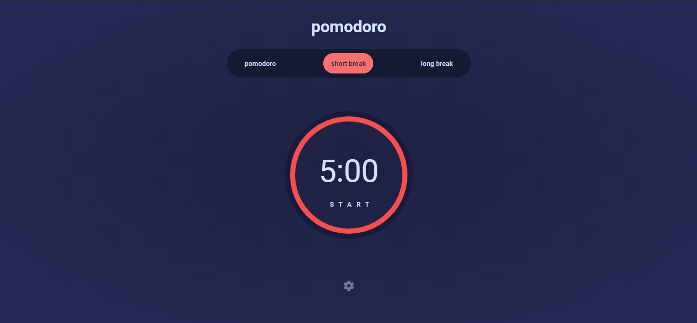
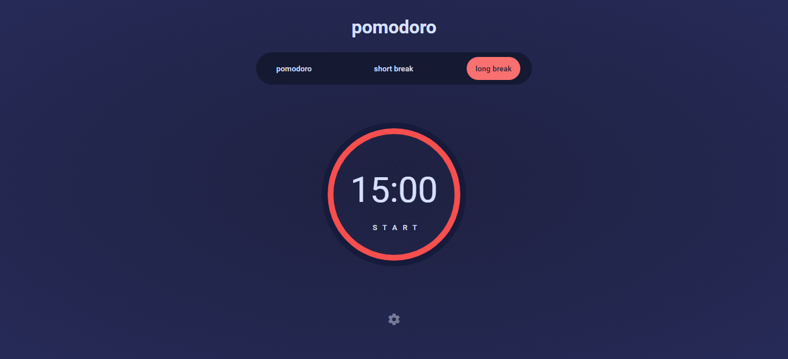
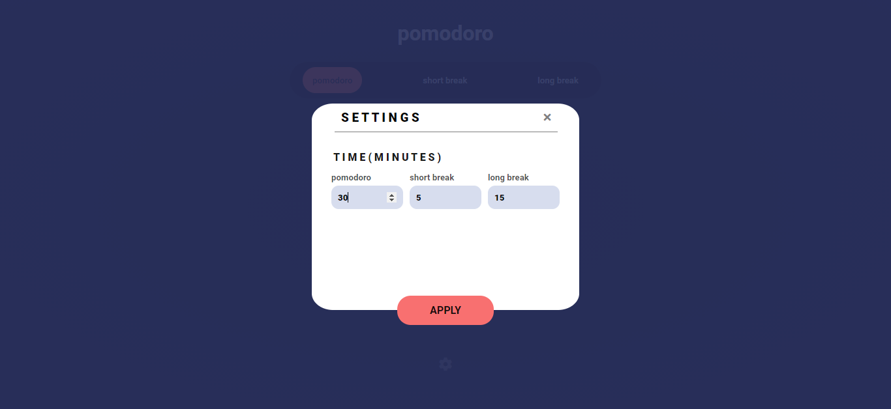
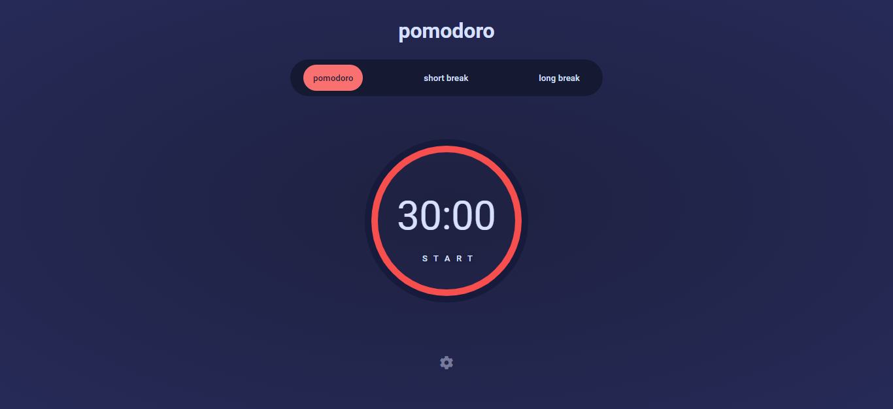
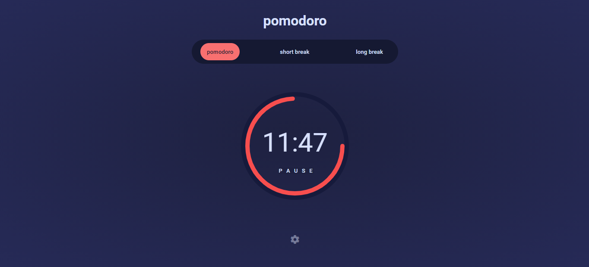

<h1 align="center">Pomodoro App</h1>

This App is featuring a default 25 minutes timer with 5 minutes and 15 minutes breaks. Of course, you can change their duration.

## Screenshots

### Pomodoro Timer

### Short Break Timer 

### Long Break Timer

### Modal for Setting timer

### Setting Changes

### Circular Progress bar

## Built With

- HTML
- CSS
- JavaScript

## Author

**Kartik Attri**

- [Profile](https://github.com/kartik-05 "Kartik Attri")

## 🤝 Support

Contributions, issues, and feature requests are welcome!

Give a ⭐️ if you like this project!
